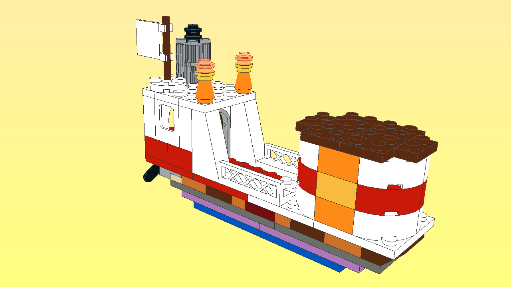
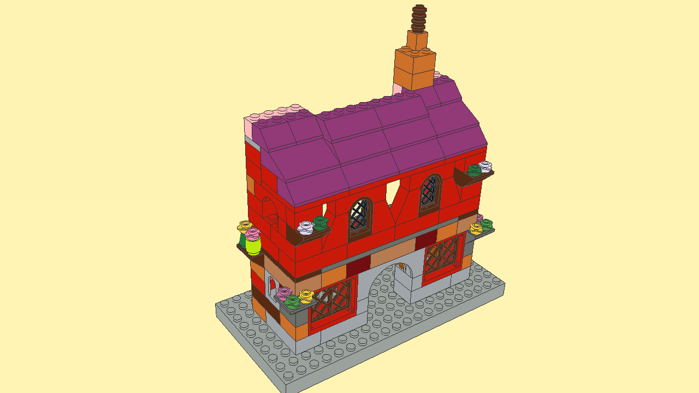

Lego Models
============

LEGO models for the kids (and myself, but don't tell anyone)

# Models

[Complete instructions PDF](all_models.pdf)

## Classic boat

This is a subset of [10692](http://brickset.com/sets/10692-1/Creative-Bricks)

[Instructions](classic_boat.pdf) — [3D model](classic_boat.ldr)

## Digger

This uses parts from [10698](http://brickset.com/sets/10698-1), as well as generic blocks and a steering wheel

[Instructions](digger.pdf) — [3D model](digger.ldr)

## Ranch

This ranch is based on [10692](http://brickset.com/sets/10692-1/Creative-Bricks)

[Instructions](ranch.pdf) — [3D model](ranch.ldr)

## Medieval house

Using parts from both [10692](http://brickset.com/sets/10692-1/Creative-Bricks) and [10698](http://brickset.com/sets/10698-1), as well as generic bricks (mostly red)

[Instructions](medieval_house.pdf) — [3D model](medieval_house.ldr)

# Generating instructions

Use Leocad to build instructions (0.82 used to far):

* Open an `ldr` file with Leocad
* Use "Print Preview" (NOT "Print" directly), set it up in Landscape and print to PDF

